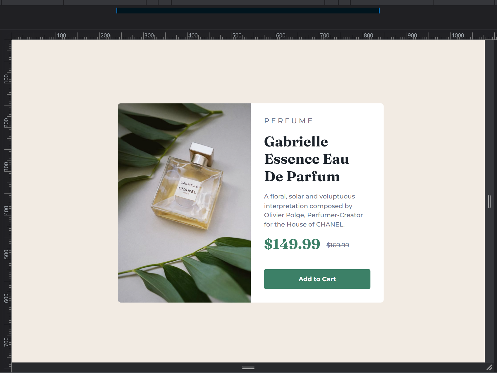
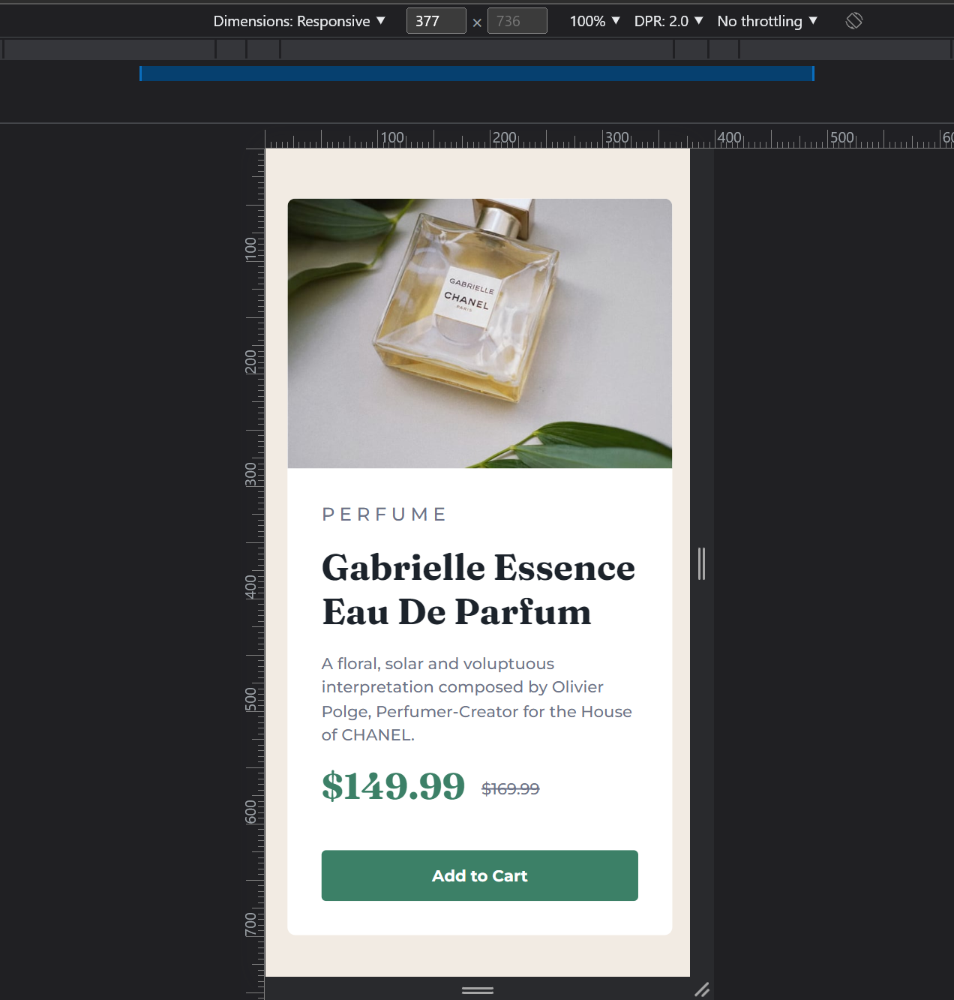

# Frontend Mentor - Product preview card component solution

This is a solution to the [Product preview card component challenge on Frontend Mentor](https://www.frontendmentor.io/challenges/product-preview-card-component-GO7UmttRfa). Frontend Mentor challenges help you improve your coding skills by building realistic projects. 

## Table of contents

- [Overview](#overview)
  - [The challenge](#the-challenge)
  - [Screenshot](#screenshot)
- [My process](#my-process)
  - [Built with](#built-with)
  - [What I learned](#what-i-learned)
  - [Continued development](#continued-development)
  - [Useful resources](#useful-resources)
- [Author](#author)

## Overview

### The challenge

Users should be able to:

- View the optimal layout depending on their device's screen size
- See hover and focus states for interactive elements

### Screenshot

## My process

  I first planned out my build. What was going to go where, how I wanted to group everything together in the HTML and how I was going to use CSS to position everything and style them.

  Once I Had an idea of how I was going to put everything together I then began to structure every thing in the HTML.

  Finally I moved on to the CSS to style and position everything according to the design.

### Built with

- Semantic HTML5 markup
- CSS custom properties
- Flexbox

### What I learned

What I learned by through this challenge was use of the command line to push and pull my work to and from github whist also practicing basic HTML and CSS.

### Continued development

I want to improve my skill on the command line to manage versions of my work along with using compilers like scss to improve my speed.

I also use EMs, REMs, and % instead of fixed measurements like PXs for better responsive designs

### Useful resources

- [HTML & CSS Course](https://www.udemy.com/course/design-and-develop-a-killer-website-with-html5-and-css3/) - This is a great course for beginners to get their feet wet with some HTML and CSS. Gave me all the knowledge I needed to start my journey in web-development.

- [MDN](https://developer.mozilla.org/en-US/) - great resource.

- [Github Docs](https://docs.github.com/en) - How to use Github.

- [Git Cheat Sheet](chrome-extension://efaidnbmnnnibpcajpcglclefindmkaj/https://education.github.com/git-cheat-sheet-education.pdf) - Github's command line cheat sheet.

## Author

- Frontend Mentor - [@CamzJJ](https://www.frontendmentor.io/profile/CamzJJ)
- Twitter - [@CameronLaudat](https://twitter.com/CameronLaudat)
- LinkedIn - [Cameron Laudat](https://www.linkedin.com/in/cameron-l-83a518a4/)

